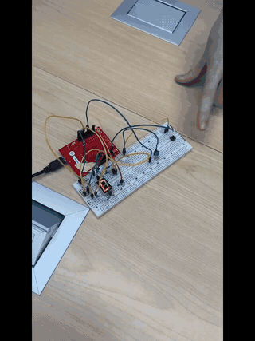
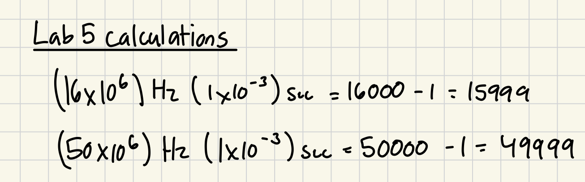

# Countdown timer with an LED fade

[Portfolio](https://github.com/agmanuel-dev) | [Technical details](#technical-details) | [File guide](#file-guide)

Press a button to start a countdown on a single-digit display. When the countdown finishes, a blue indicator LED gradually lights up and then stays on before turning off. The project combines a microcontroller, breadboard wiring and embedded C.

**Evidence:** the original hardware recording is below. The published firmware has since received timing and button-handling corrections; it passed a source-level compiler check, but those corrections have not been tested on the physical board during portfolio preparation.

**Project context:** coursework source and original media, with AI-assisted review and documentation. [Contribution and media record](PROVENANCE.md).

## Technical details

A bare-metal C countdown demo using register-level GPIO, SysTick delays and software PWM. A button starts a seven-segment countdown, followed by an LED fade and hold.

**Focus:** embedded C, bit manipulation, peripheral registers and timing.

## Hardware demonstration



[Watch or download the MP4 demo](countdown-demo.mp4?raw=true) · [View the original timing calculations](systick-calculations.jpeg)

This footage comes from the original May 2025 coursework recording and shows the LaunchPad, breadboard, button, seven-segment display and indicator LED. The approximately 21-second excerpt plays at the recorded speed; its audio was removed and it was compressed for the web. The GIF is a lower-resolution, looping preview.

**Version context:** this recording predates the September 2026 source corrections described below. It illustrates the original hardware project, and does not verify the current firmware's two-second fade or five-second hold.

<details>
<summary>Original SysTick calculation notes</summary>



For a 1 ms interval, `reload = clock_hz / 1000 - 1`. The 16 MHz calculation gives **15,999**, matching this project's clock assumption. The 50 MHz calculation is an alternative example from the original notes; this repository does not configure a 50 MHz clock.

</details>

## Sequence

1. Detect a high button input, wait 20 ms and check it again.
2. Display 9 through 0 for one second each: ten displayed seconds in total.
3. Fade an indicator LED over approximately two seconds using 100 PWM periods of 20 ms.
4. Hold the LED on for five seconds, turn it off and wait for button release.

## Wiring and assumptions

| MCU pins | Function |
|---|---|
| PF1–PF3 | Seven-segment A–C |
| PB0–PB3 | Seven-segment D–G |
| PB4 | Indicator LED |
| PF4 | Active-high external pushbutton input |

Use current-limiting resistors and a compatible active-high/common-cathode display. The original external button circuit uses a 10 kΩ pull-down and a switch to 3.3 V. This is not the default active-low on-board SW1 arrangement; PF1–PF3 also share the LaunchPad RGB LED. Account for those connections in the wiring.

The code assumes a **16 MHz system clock**. Do not enable a PLL or change the clock without updating SysTick reload values.

## Build

Create a Keil µVision project for **TM4C123GH6PM** using your installed device pack and its device startup/linker configuration. Add `main.c` and `SysTick.c`; add this directory to the include path. The supplied header contains only the register definitions needed by this demo. Device startup and flashing tools are supplied by the toolchain, not this repository.

A source-level compiler check can also be run with Arm Compiler 6:

```text
armclang --target=arm-arm-none-eabi -mcpu=cortex-m4 -mthumb -std=c99 -Wall -Wextra -Werror -fsyntax-only main.c SysTick.c
```

## Verification and limitations

The command above passed without warnings on September 12, 2026. That checks C syntax and types for Cortex-M4; it is not a linked firmware image or a hardware test. Clock configuration, brightness, pin loading and electrical behavior need board verification.

Portfolio preparation corrected the original approximately ten-second fade to approximately two seconds, explicitly turns the LED on for the hold interval and adds a 20 ms button recheck. The blocking delay design intentionally does not handle concurrent tasks. Software PWM has millisecond quantization and a 50 Hz carrier; hardware PWM would be an extension. [Provenance](PROVENANCE.md).


### Timing helper scope

The countdown uses polling at 16 MHz. The optional 50 MHz delay functions do not configure the system clock. `SysTick_Init_Interrupts()` and `SysTick_Handler()` are retained coursework helpers, unused by `main.c`; enabling that handler would also toggle PF2/PF3, which are display pins in this build. Do not combine the interrupt helper with the countdown unchanged. The PWM fade uses quantized duty cycles from 0 to 95%, followed by the explicit fully-on hold.

## File guide

| File | Purpose |
|---|---|
| [main.c](main.c) | GPIO setup, countdown, software PWM fade and button sequence. |
| [SysTick.c](SysTick.c) | Blocking delays and optional coursework interrupt helpers. |
| [SysTick.h](SysTick.h) | Function declarations for the timing helpers. |
| [tm4c123gh6pm.h](tm4c123gh6pm.h) | Minimal register addresses used by these source files. |
| [countdown-demo.gif](countdown-demo.gif) | Animated preview of the original hardware recording. |
| [countdown-demo.mp4](countdown-demo.mp4) | Silent excerpt of the original hardware recording. |
| [systick-calculations.jpeg](systick-calculations.jpeg) | Original timing calculations; the 50 MHz example is not the configured clock. |
| [README.md](README.md) | Overview, evidence, setup and limitations. |
| [PROVENANCE.md](PROVENANCE.md) | Coursework origins, assistance and contribution record. |
| [.gitignore](.gitignore) | Excludes local caches and generated files. |
